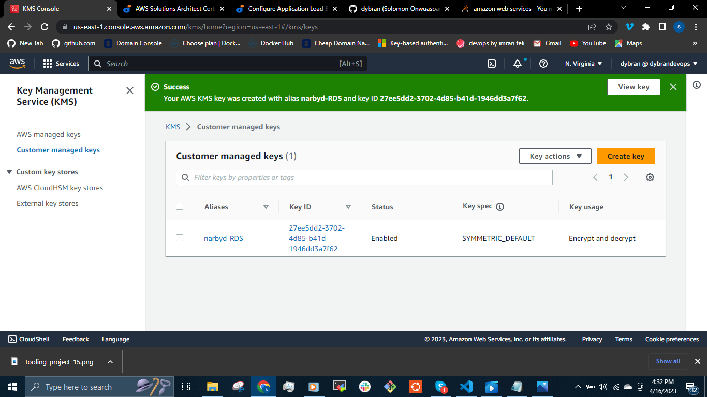
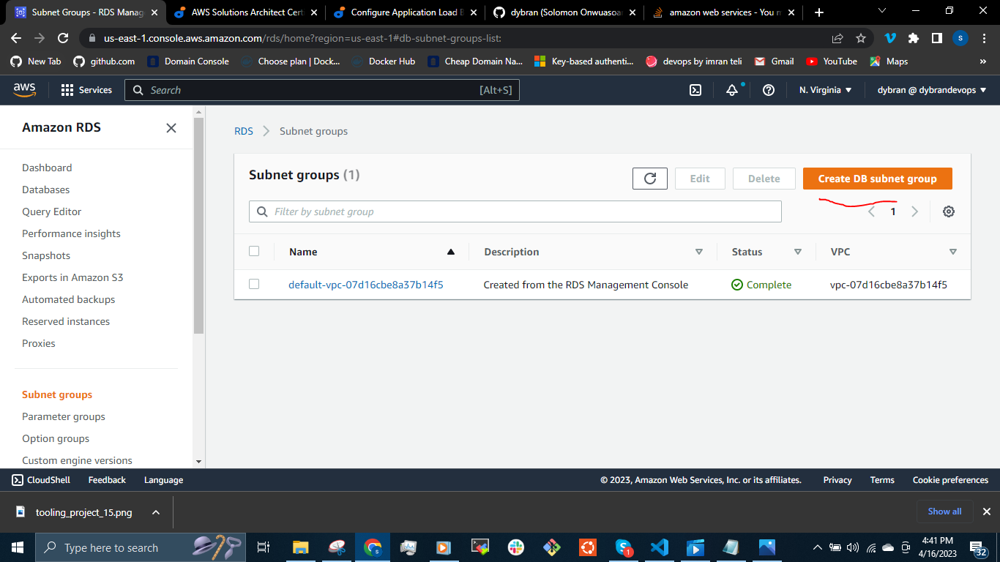
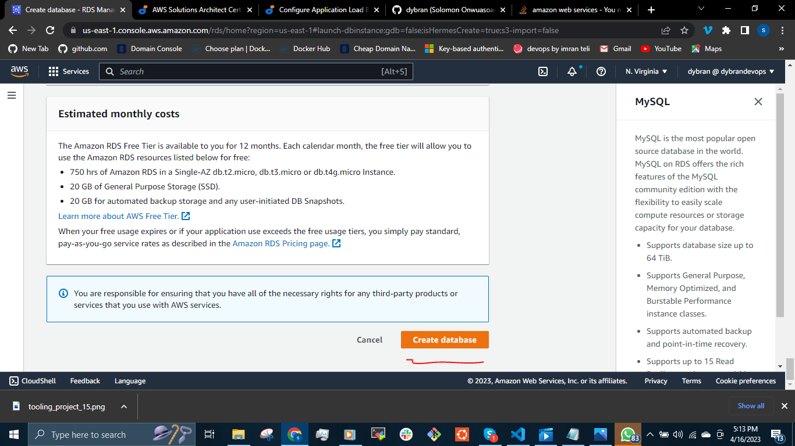
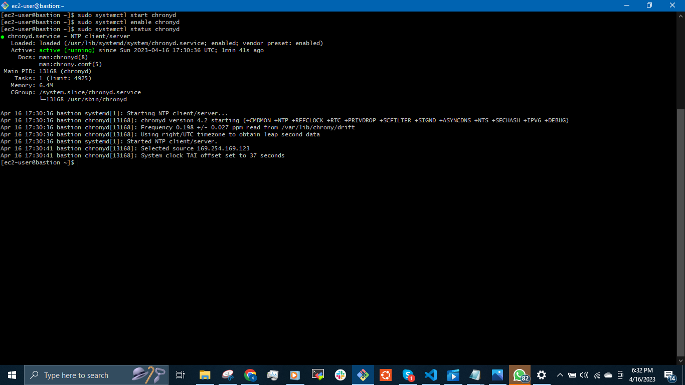
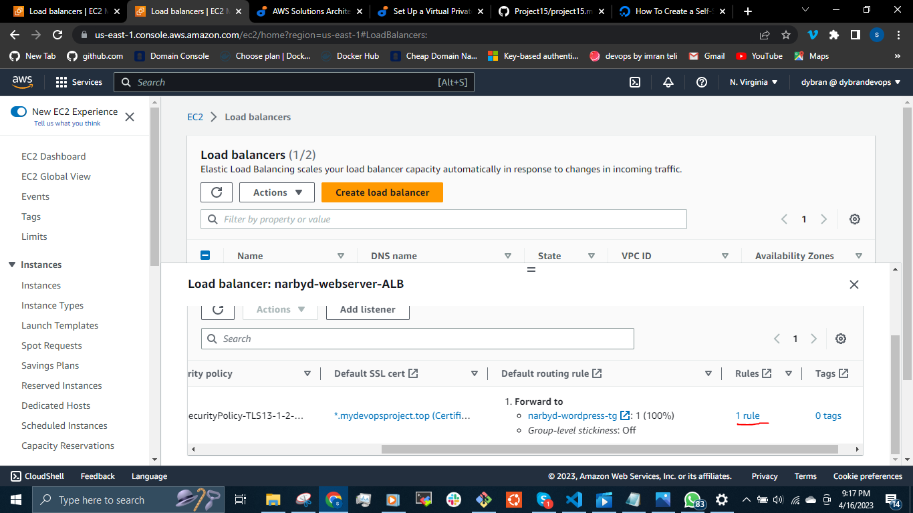
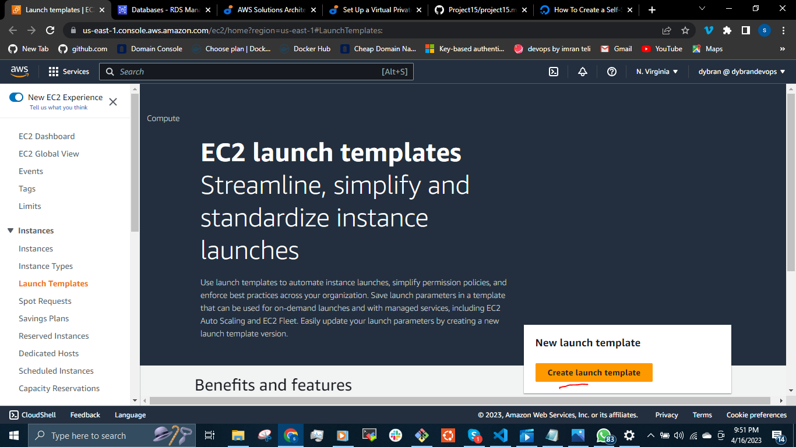

## AWS CLOUD SOLUTION FOR 2 COMPANY WEBSITES USING A REVERSE PROXY TECHNOLOGY ##

We will build a secure infrastructure inside AWS VPC (Virtual Private Cloud) network for  __narbyd Company__ that uses WordPress CMS for its main business website, and a [Tooling](https://github.com/dybran/tooling) website for the DevOps team.

As part of the company’s desire for improved security and performance, a decision has been made to use a reverse proxy technology from NGINX to achieve this.

__PURPOSE:__

Reduced Cost, increase Security and Scalability are the major requirements for this project. Hence, implementing the architecture designed below, ensure that infrastructure for both websites (WordPress and Tooling) are resilient to Web Server failures, can accomodate increased traffic and at the same time, has reasonable cost.

__AWS resources Required for the Design:__

- North Virginia Region (us-east-1)
- Availibility zones (3 subnets in us-east-1a) and (3 subnets in us-east-1b)
- VPC Network Range - __10.0.0.0/16__
- subnets - __10.0.1.0/24, 10.0.2.0/24, 10.0.3.0/24, 10.0.4.0/24, 10.0.5.0/24__ and __10.0.6.0/24__
- 6 subnets (4 private subnets and 2 public subnets)
- internet gateway
- 2 nginx for reverse proxy
- 2 bastion hosts/jump servers
- 2 application Load balancers(ALB)
- Auto scaling Groups to manage the scaling of the Ec2 instances
- 2 NAT gateways for the resources in the private subnet to communicate with the internet gateway.
  
__N/B:__ The NAT gateway only allows traffic to the internet and does not allow from the internet.

- Route DNS
- RDS for the database
- Amazon Elastic Files System for the file management


__AWS MULTIPLE WEBSITE PROJECT__


__SET UP A VIRTUAL PRIVATE NETWORK (VPC)__

Create VPC


Create subnets as shown in the architecture - 3 subnets in each Availability zones i.e __10.0.1.0/24, 10.0.3.0/24, 10.0.5.0/24__ in __us-east-1a__


And 3 subnets in Availability zone __us-east-1b__ i.e __10.0.2.0/24, 10.0.4.0/24, 10.0.6.0/24__


__N/B:__ These subnets are neither private nor public at this point. The Internet gateway and NAT gateway associated with any of them identifies them private or public.

Create a route table and associate it with public subnets


Create a route table and associate it with private subnets


Create an __Internet Gateway__ for the public subnet


Attach the internet gateway to the VPC


Edit a route in public route table and associate it with the Internet Gateway. This allows the public subnet to be accessible from the Internet)


Create 3 Elastic IPs - 1 Elastic IP will be used by the NAT gatewayw hile the remaining @ will be used by the Bastion host.


Create a NAT Gateway and assign one of the Elastic IPs. The NAT gateway is created in the public subnet


Edit a route in private route table, and associate it with the NAT Gateway. This allows traffic to be sent to the internet but not from the internet.


Create a Security Group for Application Load Balancer - Access to ALB will be allowed from the internet


Create security group for Bastion Servers - Access to the Bastion servers should be allowed only from workstations that need to SSH into the bastion servers. Hence, you can use your workstation public IP address.

We can get this by opening the CMD in our local workstation(computer)
and run the command `ipconfig`


Create security group from Application LB access will only be available from the Internet


Security Group for webservers - Access to Webservers should only be allowed from webserver ALB and bastion host.


__N/B:__ We can choose to allow __ssh__ only from the Bastion host's IP. This will mean that if the Ec2 instance is compromised them the access is lost.

This is not a good practice when applying auto scaling since it will scale out and scaling when needed and access to other Ec2 instances is denied to the bastion host.


Create a Security Group for Nginx Servers - Access to Nginx should only be allowed from a Application Load balancer (ALB) and bastion host.


Create security group for the internal ALB - allow access to only nginx reverse proxy.


Create security group for the backend services or datalayer to allow the websever access to the RDS and EFS in the backend security group. Allow access to the bastion host.


Purchase a domain name and Create an ACM certificate


Create record for both __tooling__ and __wordpress__

For tooling


For Wordpress


__SETUP ELASTIC FILE SYSTEM (EFS)__

Create EFS


We will set up the mount target to be able to acces the webservers in subnet 3 (10.0.3.0/24) and subnet 4 (10.0.4.0/24)


We need to create access points for the EFS.
Our design has two websites. If we create one accesspoint for the two websites, the files will overwrite each other. So we will create access point for __Tooling__ and __Wordpress__

Access point for __wordpress__


We will do same for access point for __tooling__


__SETUP AMAZON RELATIONAL DATABASE SYSTEM__

To set the RDS up, we need to Create a __KMS key__ from __Key Management Service (KMS)__ to be used to encrypt the database instance.




Amazon Relational Database Service (Amazon RDS) is a managed distributed relational database service by Amazon Web Services. This web service running in the cloud designed to simplify setup operations, maintance & scaling of relational databases.

To ensure that the databases are highly available and also have failover support in case one availability zone fails, we will configure a multi-AZ set up of RDS MySQL database instance. Since we are only using 2 AZs we can only failover to one but the same concept applies to 3 Availability Zones.

Configure RDS

Create a subnet group and add 2 private subnets (backend or data Layer)





Select the availability zones (us-east-1a and us-east-1b) and the subnets of the RDS from the design


Create RDS


The __production__ and __dev/test__ allows you encrypt the database using __KMS key__. We will be selecting the __free tier__ in the __mysql__ engine for the purpose of this project so as to save cost.





__SET UP COMPUTE RESOURCES__
We will be setting up the __AMI__ for the nginx, bastion and webservers for their various __Auto Scaling Groups__.

Launch  3 RHEL-8 instances - The AMIs will be used for the ASG. Lauch the instances in the default VPC.


__For Bastion Host__

Run the following commands

`$ sudo yum install -y https://dl.fedoraproject.org/pub/epel/epel-release-latest-8.noarch.rpm`

`$ sudo yum install -y dnf-utils http://rpms.remirepo.net/enterprise/remi-release-8.rpm`

`$ sudo yum install wget vim python3 telnet htop git mysql net-tools chrony -y`

`$ sudo systemctl start chronyd` 

`$ sudo systemctl enable chronyd`

`$ sudo systemctl status chronyd`




__For Nginx__

Run the followinf commands

`$ sudo yum install -y https://dl.fedoraproject.org/pub/epel/epel-release-latest-8.noarch.rpm`

`$ sudo yum install -y dnf-utils http://rpms.remirepo.net/enterprise/remi-release-8.rpm`

`$ sudo yum install wget vim python3 telnet htop git mysql net-tools chrony -y`

`$ sudo systemctl start chronyd` 

`$ sudo systemctl enable chronyd`

`$ sudo systemctl status chronyd`


Configure Selinux policies

`$ sudo setsebool -P httpd_can_network_connect=1`

`$ sudo setsebool -P httpd_can_network_connect_db=1`

`$ sudo setsebool -P httpd_execmem=1`

`$ sudo setsebool -P httpd_use_nfs 1`


Install amazon efs utils for mounting the target on the Elastic file system

`$ git clone https://github.com/aws/efs-utils`

`$ cd efs-utils`

`$ sudo yum install -y make`

`$ sudo yum install -y rpm-build`

`$ sudo make rpm` 

`$ sudo yum install -y  ./build/amazon-efs-utils*rpm`


Setting up self-signed certificate for the nginx instance. If a target group is configured with the HTTPS protocol or uses HTTPS health checks, the TLS connections to the targets use the security settings from the ELBSecurityPolicy-2016-08 policy. The load balancer establishes TLS connections with the targets using certificates that you install on the targets. The load balancer does not validate these certificates. Therefore, you can use self-signed certificates or certificates that have expired. Because the load balancer is in a virtual private cloud (VPC), traffic between the load balancer and the targets is authenticated at the packet level, so it is not at risk of man-in-the-middle attacks or spoofing even if the certificates on the targets are not valid.

`$ sudo mkdir /etc/ssl/private`

`$ sudo chmod 700 /etc/ssl/private`

`$ sudo openssl req -x509 -nodes -days 365 -newkey rsa:2048 -keyout /etc/ssl/private/narbyd.key -out /etc/ssl/certs/narbyd.crt`

`$ sudo openssl dhparam -out /etc/ssl/certs/dhparam.pem 2048`


To confirm my cert installation is successful and present in the server

`$ sudo ls -l /etc/ssl/certs/`

`$ sudo ls -l /etc/ssl/private/`


Start and enable __nginx__


__For Webserver__

Run the following commands to configure the webserver instance.

`$ sudo yum install -y https://dl.fedoraproject.org/pub/epel/epel-release-latest-8.noarch.rpm`

`$ sudo yum install -y dnf-utils http://rpms.remirepo.net/enterprise/remi-release-8.rpm`

`$ sudo yum install wget vim python3 telnet htop git mysql net-tools chrony -y`

`$ sudo systemctl start chronyd`

`$ sudo systemctl enable chronyd`

`$ sudo systemctl status chronyd`


Configure Selinux policies

`$ sudo setsebool -P httpd_can_network_connect=1`

`$ sudo setsebool -P httpd_can_network_connect_db=1`

`$ sudo setsebool -P httpd_execmem=1`

`$ sudo setsebool -P httpd_use_nfs 1`


Install amazon efs utils for mounting the target on the Elastic file system

`$ git clone https://github.com/aws/efs-utils`

`$ cd efs-utils`

`$ sudo yum install -y make`

`$ sudo yum install -y rpm-build`

`$ sudo make rpm` 

`$ sudo yum install -y  ./build/amazon-efs-utils*rpm`


setting up self-signed certificate for the apache webserver instance

`$ sudo yum install -y mod_ssl`

`$ sudo openssl req -newkey rsa:2048 -nodes -keyout /etc/pki/tls/private/narbyd.key -x509 -days 365 -out /etc/pki/tls/certs/narbyd.crt`


Using vi editor to edit the SSL certificate file path from __localhost.crt__ and __localhost.key__ to __narbyd.crt__ and __narbyd.key__ respectively

`$ sudo vi /etc/httpd/conf.d/ssl.conf`


Creating the AMIs for __Webserver, Bastion and Nginx__

Select __Instance > Action > Image and Templates > Create Image__


__Configuring Target Groups__

For Nginx Server

- Selecting Instances as the target type
- Ensuring the protocol HTTPS on secure TLS port 443
- Ensuring that the health check path is __/healthstatus__


For Wordpress

- Selecting Instances as the target type
- Ensuring the protocol HTTPS on secure TLS port 443
- Ensuring that the health check path is __/healthstatus__

For Tooling

- Selecting Instances as the target type
- Ensuring the protocol HTTPS on secure TLS port 443
- Ensuring that the health check path is __/healthstatus__
  


__Configuring Application Load Balancer (ALB)__

Create the ALB forwarding traffic to the Nginx reverse proxy


Create the ALB forwarding traffic to the Webservers


We have 2 target groups - tooling and wordpress. We have to set one of them as default. Lets set wordpress as the default.


We go to the __listeners__ to set rules for the the tooling target group





__Creating A Launch Template__

For Bastion




Similar configuration for the nginx launch template.

For the Nginx, we need to create __reverse.conf__ file. This will be used to configure to have access to the __webserver ALB__ .

Create a __reverse.conf__ file and add the following code snippet

```
user nginx;
worker_processes auto;
error_log /var/log/nginx/error.log;
pid /run/nginx.pid;

# Load dynamic modules. See /usr/share/doc/nginx/README.dynamic.
include /usr/share/nginx/modules/*.conf;

events {
    worker_connections 1024;
}

http {
    log_format  main  '$remote_addr - $remote_user [$time_local] "$request" '
                      '$status $body_bytes_sent "$http_referer" '
                      '"$http_user_agent" "$http_x_forwarded_for"';

    access_log  /var/log/nginx/access.log  main;

    sendfile            on;
    tcp_nopush          on;
    tcp_nodelay         on;
    keepalive_timeout   65;
    types_hash_max_size 2048;

    
    default_type        application/octet-stream;

    # Load modular configuration files from the /etc/nginx/conf.d directory.
    # See http://nginx.org/en/docs/ngx_core_module.html#include
    # for more information.
    include /etc/nginx/conf.d/*.conf;

     server {
        listen       80;
        listen       443 http2 ssl;
        listen       [::]:443 http2 ssl;
        root          /var/www/html;
        server_name  *.mydevopsproject.top;
        
        
        ssl_certificate /etc/ssl/certs/narbyd.crt;
        ssl_certificate_key /etc/ssl/private/narbyd.key;
        ssl_dhparam /etc/ssl/certs/dhparam.pem;

      

        location /healthstatus {
        access_log off;
        return 200;
       }
    
         
        location / {
            proxy_set_header             Host $host;
            proxy_pass                   https://internal-narbyd-webserver-ALB-1635565532.us-east-1.elb.amazonaws.com/; 
        }
    }
}
```

Push to the github so we can use it to set up the nginx launch template

`$ git add .`

`$ git commit -m "added reverse.conf file"`

`$ git push`

Create the Nginx ALB to use the __reverse.conf__ file through the user data.


For the Wordpress

We configure the wordpress using the user data. First we mount the EFS access point of the wordpress using the user data configurations.


Wordpress userdata

```
#!/bin/bash

#mount wordpress acces point
mkdir /var/www/
sudo mount -t efs -o tls,accesspoint=fsap-075d969a83a54d104 fs-039addedc443b6916:/ /var/www/

#Install httpd
yum install -y httpd 
systemctl start httpd
systemctl enable httpd

#install dependencies
yum module reset php -y
yum module enable php:remi-7.4 -y
yum install php php-common php-mbstring php-opcache php-intl php-xml php-gd php-curl php-mysqlnd php-fpm php-json -y
systemctl start php-fpm
systemctl enable php-fpm

#download wordpress
wget http://wordpress.org/latest.tar.gz

#setup wordpress
tar xzvf latest.tar.gz
rm -rf latest.tar.gz
cp wordpress/wp-config-sample.php wordpress/wp-config.php
mkdir /var/www/html/
cp -R /wordpress/* /var/www/html/

#create healthstatus file
cd /var/www/html/
touch healthstatus

#changing the localhost to RDS endpoint
sed -i "s/localhost/narbyd-database.cwndedhlcmgg.us-east-1.rds.amazonaws.com/g" wp-config.php

#set up the username and password 
sed -i "s/username_here/narbyd/g" wp-config.php 
sed -i "s/password_here/sa4la2xa/g" wp-config.php 
sed -i "s/database_name_here/wordpressdb/g" wp-config.php 
chcon -t httpd_sys_rw_content_t /var/www/html/ -R
systemctl restart httpd
```


For Tooling

We will create the lauch template using the user data below

```
#!/bin/bash
mkdir /var/www/
sudo mount -t efs -o tls,accesspoint=fsap-0c6229307091b5b33 fs-039addedc443b6916:/ /var/www/
yum install -y httpd 
systemctl start httpd
systemctl enable httpd
yum module reset php -y
yum module enable php:remi-7.4 -y
yum install -y php php-common php-mbstring php-opcache php-intl php-xml php-gd php-curl php-mysqlnd php-fpm php-json
systemctl start php-fpm
systemctl enable php-fpm
git clone https://github.com/dybran/tooling.git
mkdir /var/www/html
cp -R /tooling/html/*  /var/www/html/
cd /tooling
mysql -h narbyd-database.cwndedhlcmgg.us-east-1.rds.amazonaws.com -u narbyd -p toolingdb < tooling-db.sql
cd /var/www/html/
touch healthstatus
sed -i "s/$db = mysqli_connect('mysql.tooling.svc.cluster.local', 'admin', 'admin', 'tooling');/$db = mysqli_connect('narbyd-database.cwndedhlcmgg.us-east-1.rds.amazonaws.com', 'narbyd', 'sa4la2xa', 'toolingdb');/g" functions.php
chcon -t httpd_sys_rw_content_t /var/www/html/ -R
systemctl restart httpd
```


__Creating the Auto Scaling Group__

We will create the auto scaling group using the lauch templates.

For Bastion


For Nginx


Check if it is __Healthy__

1[](./images/heal.PNG)

Before creating the Auto Scaling Group for the webservers, we will go into the RDS and create the wordpress database

Copy the __.prem key__ into the bastion host


Connect remotely to the RDs from the bastion host

`$ mysql -h narbyd-database.cwndedhlcmgg.us-east-1.rds.amazonaws.com -u narbyd -p`


Create Auto Scaling Group for webserver wordpress and tooling respectively.

For wordpress


For tooling


__N/B:__ Check for the health status of the tooling, wordpress, nginx and bastion ASG

We can use `$ telnet <private-IP-address or DNS> <port-number> to check for connectivity between servers.

The ASG launches the Ec2 Instances from the launch templates


Open the browser __incognito__ using __"CTRL + SHIFT + n"__ and paste the domain name i.e `wordpress.mydevopsproject.top` 


or `tooling.mydevopsproject.top`


